<!--
  Denis · profile README — "observability dashboard for a human"
  Theme: dark status-page / Grafana. Accent #6366F1.
  The big panels are hand-crafted SVGs in assets/ (no external services, never break).
  The Claude panel (assets/claude.svg) is regenerated from data/usage.json — see SETUP.md.
-->

<div align="center">
  
</div>

<p align="center">
  <a href="mailto:denissuc.den@gmail.com"></a>
  <a href="https://www.nine.ch"></a>
  
  
</p>

<p align="center">
  <a href="https://github.com/BusyDenis/BusyDenis">
    
  </a>
</p>

---

```sh
$ whoami --verbose
> denis @ nine.ch · 19 · 2nd-year apprentice
$ uptime
> learning since 2023 · load average: high, by choice
```

<br>

<div align="center">
  
</div>

<br>

### 🤖 my usage &nbsp;<sub>`/ live · tokscale`</sub>

<div align="center">
  <a href="https://tokscale.ai/u/BusyDenis"></a>
</div>

<br>

---

<div align="center">
  <a href="https://buymeacoffee.com/denissucder">
    
  </a>
</div>
