<!--
  Denis · profile README — "observability dashboard for a human"
  Theme: dark status-page / Grafana. Accent #6366F1.
  The big panels are hand-crafted SVGs in assets/ (no external services, never break).
  The Claude panel (assets/claude.svg) is regenerated from data/usage.json — see SETUP.md.
-->

<div align="center">
  
</div>

<p align="center">
  <a href="mailto:denis@nine.ch"></a>
  <a href="https://www.nine.ch"></a>
  
  
</p>

---

```sh
$ whoami --verbose
> denis @ nine.ch · 18 · infrastructure & ops
> I make machines report on themselves — sensors, metrics, dashboards, OTA fleets.
> Comfortable in a terminal. Currently teaching myself the application side.
$ uptime
> learning since 2023 · load average: high, by choice
```

<br>

<div align="center">
  
</div>

<br>

### ◍ github telemetry &nbsp;<sub>`/ live · scraped from the source`</sub>

<div align="center">
  
  
</div>

<div align="center">
  
</div>

<br>

### 🤖 ai co-pilot telemetry &nbsp;<sub>`/ auto-updated from ccusage — see SETUP.md`</sub>

<div align="center">
  
</div>

<br>

### ▦ scrape targets &nbsp;<sub>`/ currently monitoring`</sub>

| status | target | description |
|:------:|:-------|:------------|
| 🟢 `UP`   | **office-metrics**   | Pi Zero 2 W + Enviro+ → Prometheus / Grafana environmental monitoring |
| 🟢 `UP`   | **kernel.rpi**       | custom gokrazy kernel fork (ADAU7002 mic, ASoC) for arm64 appliances |
| 🟡 `WARM` | **nine-mcp**         | MCP server prototype for Nine Cockpit (Python, learning the app side) |
| 🟡 `WARM` | **learning/python**  | leveling up beyond ops — APIs, services, the application layer |

<br>

---

<div align="center">
  <sub>◆ if a panel ever helped or just made you smile, the coffee machine accepts pings ◆</sub>
  <br><br>
  <a href="https://buymeacoffee.com/denissucder">
    
  </a>
  <br><br>
  <sub><code>end of stream · status: OPERATIONAL · thanks for scraping</code></sub>
</div>
